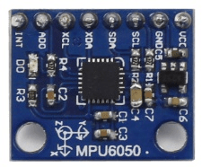

# 使用 ESP32 連接 WiFi 控制裝置

## Flag's 創客‧自造者工作坊 用 python 學 AIOT 智慧聯網

整合 AI 機器學習 + IOT 物聯網 的專題實作。

實作範圍涵蓋電子電路、微電腦控制器、WiFi 網路連線、AI 機器學習。

圖: ESP-­WROOM­32

圖: ESP32 線路圖

## 硬體設定

- 開啟 ESP32 按鈕腳位內建的上拉電阻，防止輸入腳位接收到不穩定的訊號。
  上拉電阻沒按按鈕回傳值為 1，反之為 0。
- D25，D26 為 ADC(Analog to digital converter) 類比數位轉換器腳位，分別連接六軸感測器的 SCL 及 SDA 腳位。
- VIN 腳位連接 USB 插座的 VBUS 腳位，供 5V 電壓給 LED 燈。USB 插座的 D+和 D-是訊號腳位。
- 電晶體(2N2222)C 極接 LED 燈，E 極接地，B 極與 ESP32 之間加一個 1kΩ 電阻，預防突波。

## 1. 用手勢控制鍵盤上下左右。

https://www.youtube.com/watch?v=vqiCubyfHLA

### 按住按鈕後動作。

### 簡介:

- 硬體：ESP32、六軸感測器、WiFi 。
- 技術：機器學習、WiFi 遠端控制鍵盤 。
- 目的：用手勢控制鍵盤上下左右，按住 ESP32 上的按鈕後動作。
- Colab+Keras(類神經網路)、Machine(硬體)、pynput(控制鍵盤)、socket(網路介面)。
- 開發環境：Colab、Thonny-ESP32 讀取六軸感測器的值、Thonny-電腦端 控制鍵盤。

圖: 六軸感測器

### 資料處理

1. 蒐集資料 : 紀錄上、 下、 左、 右手勢的六軸數據各 500 筆(單筆手勢資料長度 6\*10)。 → Thonny-ESP32

2. 建立神經網路 : 多元分類(mode : categorical ) → Colab

   - 90% 資料當訓練集，並對訓練資料正規化。取最後 5 筆資料當作測試集。其餘資料當作驗證集。

     • 紀錄正規化使用的平均值與標準差。

   - 建立神經網路架構 : 1 層神經網路， activation='softmax'， input_shape=(60, )。

     • Softmax 回歸適用於多分類的問題， 每個標籤的機率總和為 1，機率最大的標籤為結果。

   - 編譯及訓練模型 : optimizer='adam'，loss='categorical_crossentropy'。epochs=300。

     • 訓練過程 loss 越小、acc 越大，代表模型越好。

   - 測試模型 : 預測結果與實際值相符，儲存模型成 json 格式。結果不符合則繼續調整訓練模型， 直到結果相符。

   - 儲存模型 : 將模型儲存成 json 格式。將 json 檔、平均值與標準差一起上傳到 ESP32。

### 手勢偵測

1. 上傳 gesture_mode.json 到 ESP32。 → Thonny-ESP32

2. 手勢偵測檔案。 → Thonny-ESP32

   - 複製正規化使用的平均值與標準差至手勢偵測檔案。

   - 將紀錄到的六軸數據正規化後代入訓練好的模型，測試辨識結果。

   - 如果辨識結果不佳，可重新蒐集更多資料，幫助神經網路分類。

### WiFi 控制鍵盤

伺服器端(ESP32)。 → Thonny-ESP32

     - Server端檔名改成"main.py"並存入ESP32。

     - "main.py"檔會對客戶端發出方向訊號。

客戶端(電腦端) 。 → Thonny-電腦

     - 依據接收到的訊號控制鍵盤。

## 2. 聲控 LED 燈 開啟或關閉。

https://www.youtube.com/watch?v=IRhc0jwfOvA

### 聲音指令:

- 開啟: on 開燈
- 關閉: off 關燈
- 雜音: others 不動作

### 簡介:

- 技術： ESP32、聲音感測器、喇叭、 LED 燈(5V)、 WiFi。
- 目的： 聲控 LED 燈 開啟或關閉。
- Python：Colab+Keras(類神經網路)、Machine(硬體)。
- 開發環境： Colab、Thonny-ESP32。

圖: 聲音感測器

### 資料處理

1. 蒐集資料 : 紀錄開啟、 關閉、 其他的聲音指令各 100 筆 (單筆聲音資料長度 400 )，。 → Thonny-ESP32

   - 為了記錄聲音細微變化，將 ADC(類比轉數位)解析度設定成最高 12bit。(ESP32 ADC 最高採樣頻率為 6000Hz。)

   - 用喇叭撥放麥克風記錄到的聲音，測試記錄到的訊號。

   - 開啟 LED 燈的電壓變化會影響感測器的值，後 50 筆資料紀錄開啟 LED 燈時的聲音特徵。

   - 資料長度不足 400， 在後面補 0 。 連續 150 個 0， 判斷說話結束。每筆資料長度不超過 550(400+150)。

   - 資料長度小於 150，判斷為雜音。

2. 建立神經網路 : CNN(卷積神經網路) → Colab

   - 90% 資料當訓練集，並對訓練資料正規化。取最後 5 筆資料當作測試集。其餘資料當作驗證集。

     • 紀錄正規化使用的平均值與標準差。

   - 建立神經網路架構 : 3 個卷積層(activation='relu')+池化層，1 層展平層，1 層密集層(activation='softmax')。

   - 編譯及訓練模型 : optimizer='adam'，loss='categorical_crossentropy'。epochs=60。

     • 訓練過程 loss 越小、acc 越大，代表模型越好。

   - 測試模型 : 預測結果與實際值相符，儲存模型成 json 格式。結果不符合則繼續調整訓練模型， 直到結果相符。

   - 儲存模型 : 將模型儲存成 json 格式。將 json 檔、平均值與標準差一起上傳到 ESP32。

### 聲控 LED 燈

1. 上傳 voice_mode.json 到 ESP32。 → Thonny-ESP32

2. 聲控燈檔案。 → Thonny-ESP32

   - 複製正規化使用的平均值與標準差至聲控燈檔案 。

   - 將紀錄到的聲音數據正規化後代入訓練好的模型，測試辨識結果。

   - 如果辨識結果不佳，可重新蒐集更多資料，幫助神經網路分類。

#### 以上內容為 "Flag's 創客‧自造者工作坊 用 python 學 AIOT 智慧聯網" 的實作。
